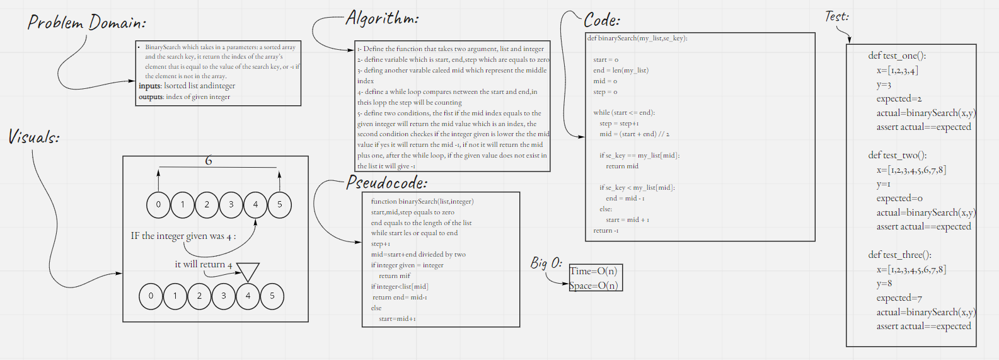

# binary search

## This project is containing a BinarySearch which takes in 2 parameters: a sorted array and the search key, it return the index of the array’s element that is equal to the value of the search key, or -1 if the element is not in the array.

## Whiteboard Process

## Approach & Efficiency
- there are many different ways to recurrion, the way using while lopp it enahnce my understand to the logic
- Big O time and space for this code are O(logN), O(1) respectively.

