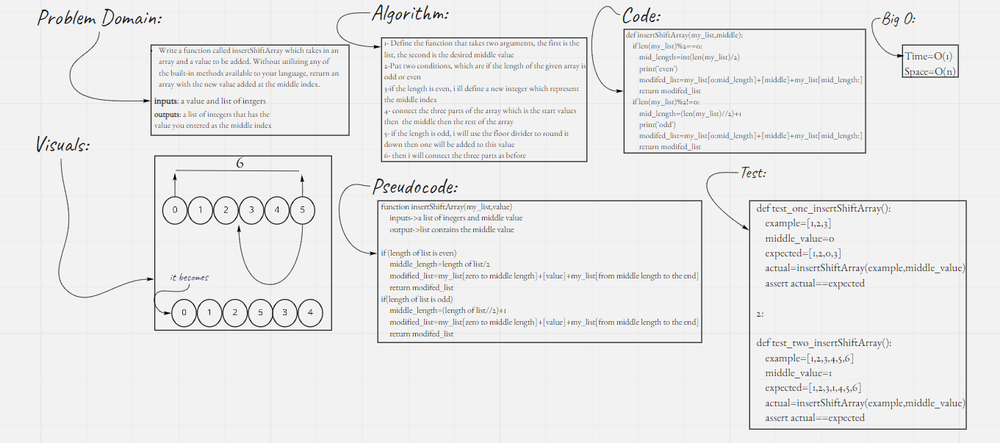

# Array inserting and shifting
## Whiteboard Process
- This project contains a insertShiftArray function which takes in an array and a value to be added and returns an array with the new value added at the middle index.

## Approach & Efficiency
- I took the connection way, because it make sense and no much space and time needed
- Big O time and space for this code are O(logN), O(1) respectively.
