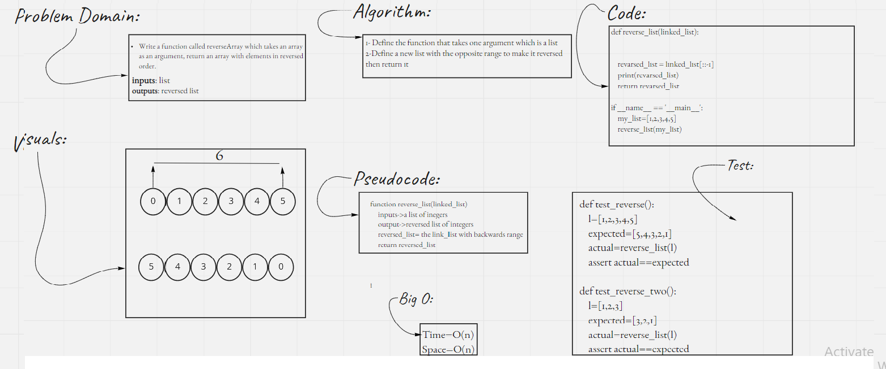

# Revearse linked list
- This project is made to reverse a given list
## Whiteboard Process

## Approach & Efficiency
- I used the simplest way which reversing the range, because it not taking any space or time and its one line of code.
- It has no Big O, its linear
