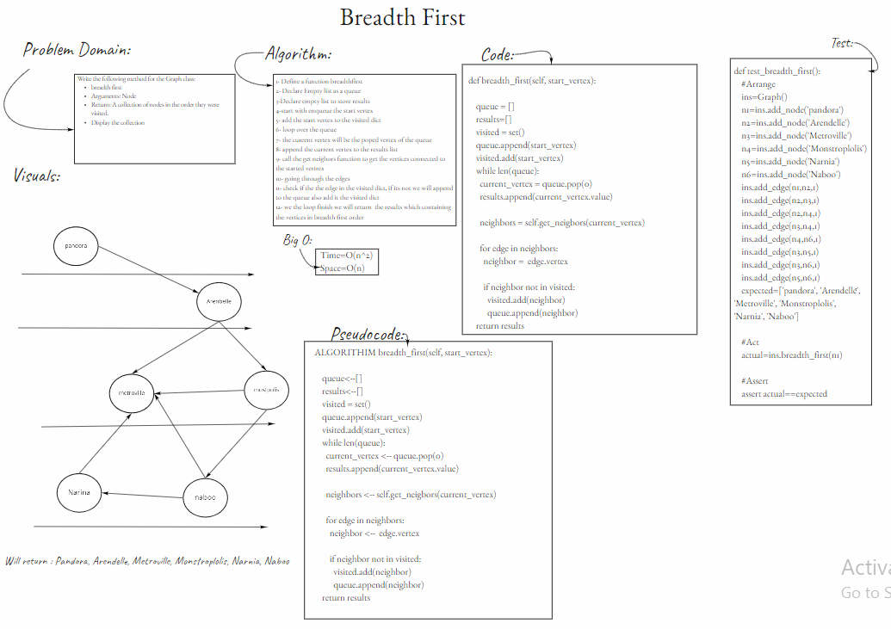
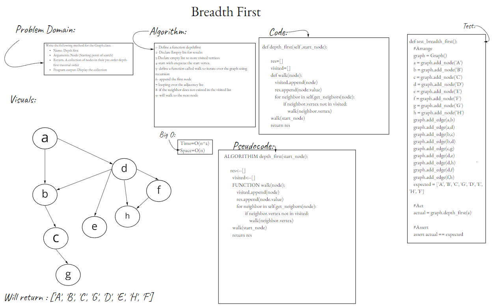

# [Graphs](https://github.com/majedalswaeer/data-structures-and-algorithms/tree/graph/python/graphs)
- Check the [PR](https://github.com/majedalswaeer/data-structures-and-algorithms/pull/24) out
- A graph is a pictorial representation of a set of objects where some pairs of objects are connected by links. The interconnected objects are represented by points termed as vertices, and the links that connect the vertices are called edges.

## Challenge
- Implement your own Graph. The graph should be represented as an adjacency list, and should include the following methods:
    - add node
       - Arguments: value
       - Returns: The added node
       - Add a node to the graph

    - add edge
       - Arguments: 2 nodes to be connected by the edge, weight (optional)
        - Returns: nothing
        - Adds a new edge between two nodes in the graph
        - If specified, assign a weight to the edge
        - Both nodes should already be in the Graph

    - get nodes
        - Arguments: none
        - Returns all of the nodes in the graph as a collection (set, list, or similar)

    - get neighbors
        - Arguments: node
        - Returns a collection of edges connected to the given node
        - Include the weight of the connection in the returned collection
    - size
        - Arguments: none
        - Returns the total number of nodes in the graph
    - breadth_first
        - This function takes a vertex to start with, and return a list containing the nodes in the graph according to the breadth first order

        - Args: start_vertex ([type]): Vertex

        - Returns: List of vertices
    - depth_first

        - This function takes a vertex to start with, and return a list containing the nodes in the graph according to the depth first order

        -  Args: start_vertex ([type]): Vertex

        -  Returns: List
## White Board process
- `breadth_first`

- 
- `depth_first`

- 
## Approach & Efficiency
- All method implemented does not exceeding O(n) for time and space

## API
- `add node`
       - Arguments: value
       - Returns: The added node
       - Add a node to the graph

- `add edge`
    - Arguments: 2 nodes to be connected by the edge, weight (optional)
    - Returns: nothing
    - Adds a new edge between two nodes in the graph
    - If specified, assign a weight to the edge
    - Both nodes should already be in the Graph

- `get nodes`
    - Arguments: none
    - Returns all of the nodes in the graph as a collection (set, list, or similar)

- `get neighbors`
    - Arguments: node
    - Returns a collection of edges connected to the given node
    - Include the weight of the connection in the returned collection

- `size`
    - Arguments: none
    - Returns the total number of nodes in the graph

- `breadth_first`
    - This function takes a vertex to start with, and return a list containing the nodes in the graph according to the breadth first order

    - Args: start_vertex ([type]): Vertex

    - Returns: List of vertices
- `depth_first`

    - This function takes a vertex to start with, and return a list containing the nodes in the graph according to the depth first order

    -  Args: start_vertex ([type]): Vertex

    -  Returns: List

