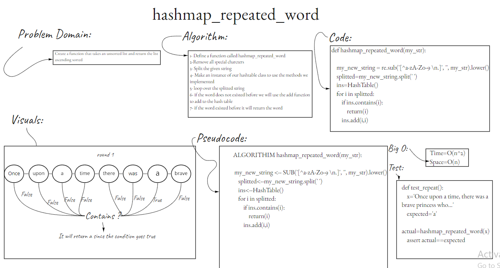

# [Hash Tables](https://github.com/majedalswaeer/data-structures-and-algorithms/tree/hashTable/python/hashTables)
- Check [the pull request out](https://github.com/majedalswaeer/data-structures-and-algorithms/pull/20)
- Check [the pull request for hash repeated out](https://github.com/majedalswaeer/data-structures-and-algorithms/pull/21)
- Check [the pull request for hash table intersections out](https://github.com/majedalswaeer/data-structures-and-algorithms/pull/22)

## Description
- This challenge representing the new data structure that we took which is the hash table

## Challenge
- Implementing a hash table that is able to add key/value pairs to it

## White Board process
- `hashmap_repeated_word`


## Approach & Efficiency
- All methods existed in the hash table is not exceeding big O(n), that the benefit of the hash table that we can retrieve, add and check our data in a very low time and space complexity.

## API

- `Hash`

    ```
    Hash function which hash the given key with specfic number

            Args:
                key ([type]): Any

            Returns:
                Integer
    ```
- `Add`

    ```
    Add function adds a key/value pair into the hash table

            Args:
                key ([type]): Any
                value ([type]): Any
    ```
- `Get`

    ```
    Get function retrive a value that is associated with the given key

            Args:
                key ([type]): Any

            Returns:
                Value if existed (Any type of data)
                Exception if the key does not exist

    ```
- `Contains`

    ```
    Contain function checks whether if the key given existed or not in the hash table

            Args:
                key ([type]): Any

            Returns:
                [type]: Boolean

    ```
- `hashmap_repeated_word`
    ```
    This function takes a string and return a string with the most first occurance

    Args:
        my_str ([type]): String
    Return:
        String

    ```
- `tree-intersection`
    ```
    This function takes two binary trees and finds the inersections between them.

    Args:
        Two binary trees
    Return:
        List with intersections
    ```
