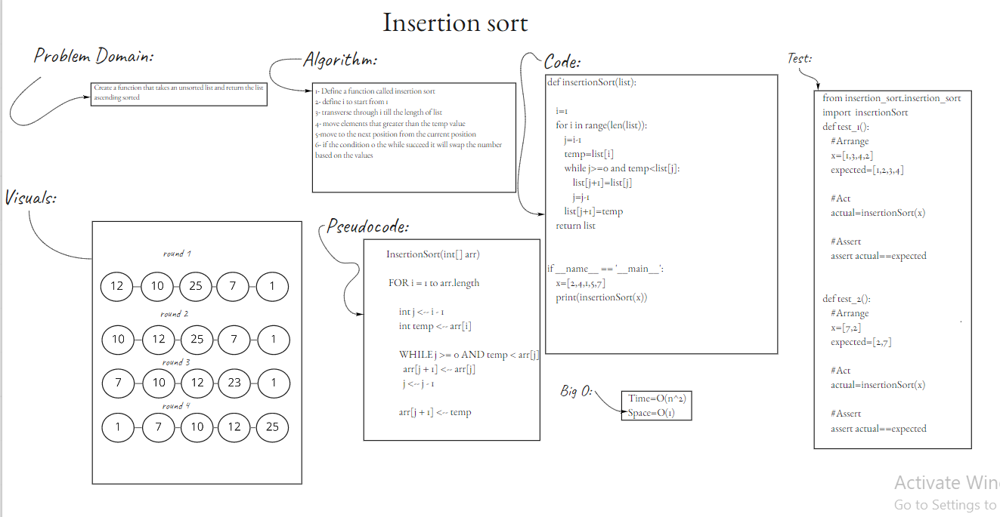
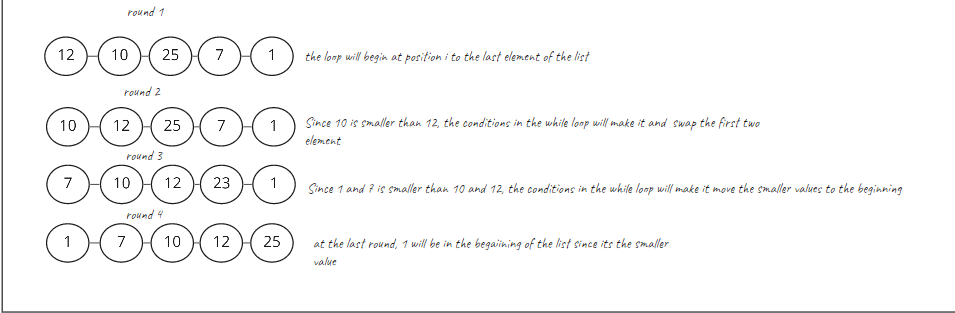

# [Insertion Sort](https://github.com/majedalswaeer/data-structures-and-algorithms/tree/insertionsort/python/insertion_sort)
- Insertion sort is a function that insert the lower values at the beginning

## Challenge
Create a function that takes an unsorted list and return the same list sorted

## Approach & Efficiency
- `InsertionSort` has big O of `O(n^2)` for time and `O(n)` for space

## API
- `insertionSort`
    ```
    """
    This function takes a list as an input and return the same array with sorted values

    Args:
        list

    Return:
        Sorted list
    """

# White Board
- Check the WhiteBoard out
     

# Blog
- Check the Blog out
     
