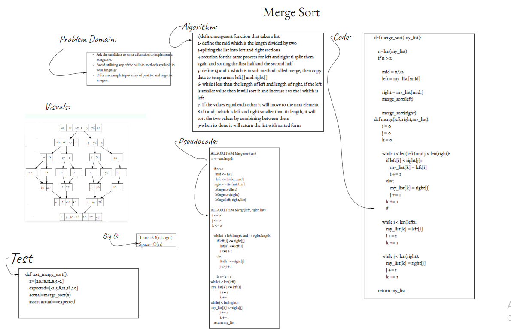
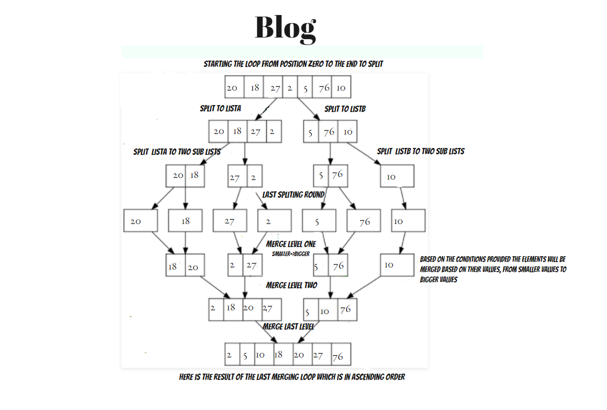

# [Merge sort](https://github.com/majedalswaeer/data-structures-and-algorithms/tree/mergeSort/python/merg_sort)
- Merge sort is a function that insert the lower values at the beginning
- Check [the pull request out](https://github.com/majedalswaeer/data-structures-and-algorithms/pull/18)
## Challenge
Create a function that takes an unsorted list and return the same list sorted

## Approach & Efficiency
- `Merge_sort` has big O of `O(nLogn)` for time and `O(1)` for space

## API
- `Merge_sort`
    ```
    """
    This function takes a list as an input and return the same array with sorted values

    Args:
        list

    Return:
        Sorted list
    """

# White Board
- Check the White Board out
     


# Blog
- Check the blog out
     
