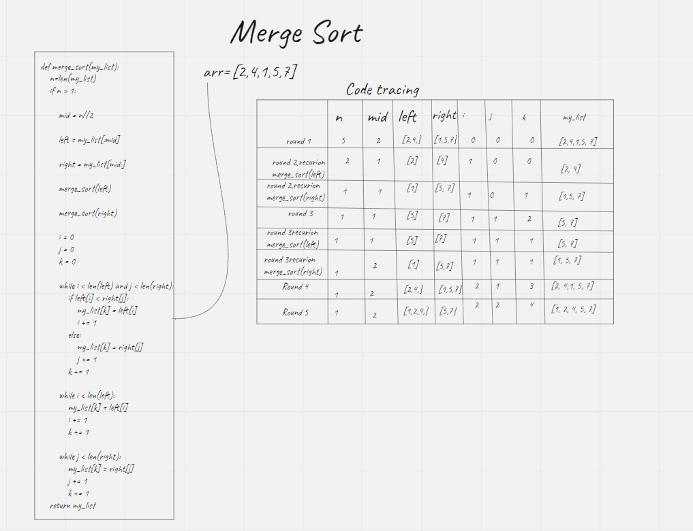

# Merge sort
- Merge sort is a function that insert the lower values at the beginning

## Challenge
Create a function that takes an unsorted list and return the same list sorted

## Approach & Efficiency
- `Merge_sort` has big O of `O(n^3)` for time and `O(n)` for space

## API
- `Merge_sort`
    ```
    """
    This function takes a list as an input and return the same array with sorted values

    Args:
        list

    Return:
        Sorted list
    """

# Blog
- Check the blog out
     
