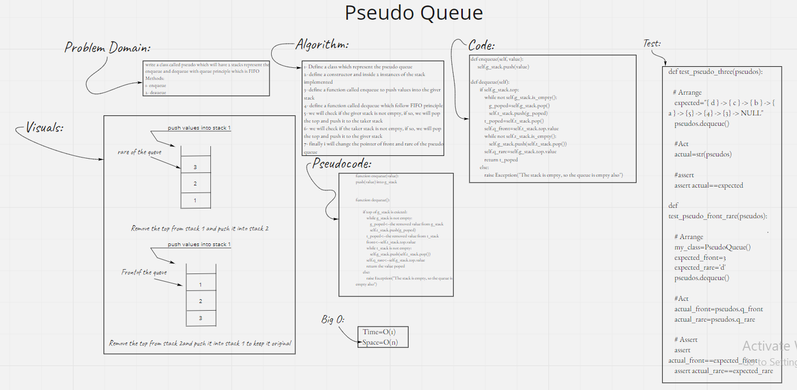
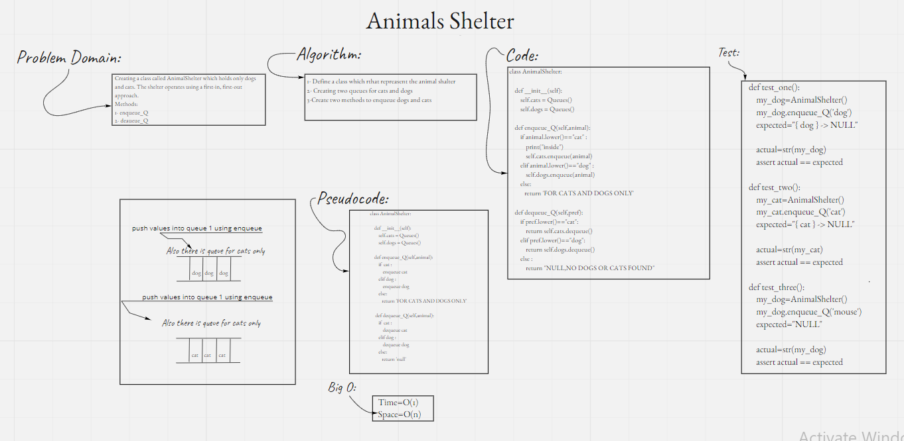

# `Stacks and Queues`

- [Stacks and Queues Folder](https://github.com/majedalswaeer/data-structures-and-algorithms/tree/stack-and-queue/python/stacks_and_queues)
- `Stack` is a container of objects that are inserted and removed according to the last-in first-out (LIFO) principle.
- `Queue` is a container of objects (a linear collection) that are inserted and removed according to the first-in first-out (FIFO) principle.


## Challenge
- Bild data structures with stacks and queues and implement methods on them like `push`, `pop`, `peek` and `is_empty` on `Stacks`, also, `enqueue`, `dequeue`, `peek`, and `is_empty`on `Queues`

## Approach & Efficiency
- Buliding a node, stack and quesues classes and implement the methods mention above on them
- The big O notiation for space and stime for both queues and stacks is O(1)

## API
- Stacks
    - `push`:
    ```
    Description: This function pushs nodes into the stack when called

    Args:
        value (int or str)
    ```
    - `pop`:
    ```
    Description: This function remove a node from the stack when called
    return: the value of the removed node
    ```
    - `peek`:
    ```
    Description: This function shows the top node in the stack when called
    return: the value of the top node
    ```
    - `is_empty`:
    ```
    Description: This function checks if the stack is empty
    return: True, if the stack is empty
            False, if the stack is not empty
    ```
- Queues
    - `enqueue`:
    ```
    Description: This function pushs nodes into the end of the queue when called

    Args:
        value (int or str)
    ```
    - `dequeue`:
    ```
    Description: This function remove a node from the front of the queue when called
    ```
    - `peek`:
    ```
    Description: This function shows the front node in the queue when called
    return: the value of the top node
    ```
    - `is_empty`:
    ```
    Description: This function checks if the queue is empty
    return: True, if the queue is empty
            False, if the queue is not empty
    ```
# `stack-queue-pseudo`


## Challenge Summary
Define a PseudoQueue class that will implement our standard queue interface (the two methods listed below)

## Whiteboard Process
- `stack-queue-pseudo`


## Approach & Efficiency
- Buliding pseudo quesues class and implement the methods mention below on them
- The big O notiation for space and time for both queues and stacks is O(1) and O(n) respectively

## API
- `enqueue`:
        ```
        This function push the value given into the giver stack

        Args:
            value: integer or string

- `dequeue`:


        Description:
        This function push the value removed from the giver stack and give it to the taker stack and adjusting the pointers for front and rare after dequeuing

# `stack-queue-animalshelter`
# Challenge Summary
- Creating a class called AnimalShelter which holds only dogs and cats. The shelter operates using a first-in, first-out approach.

## Whiteboard Process


## Approach & Efficiency
I used the original enqueing and dequeue from the queues, then i created instances for both cats and dogs
The methods has O(1) big O complexity for time and space

