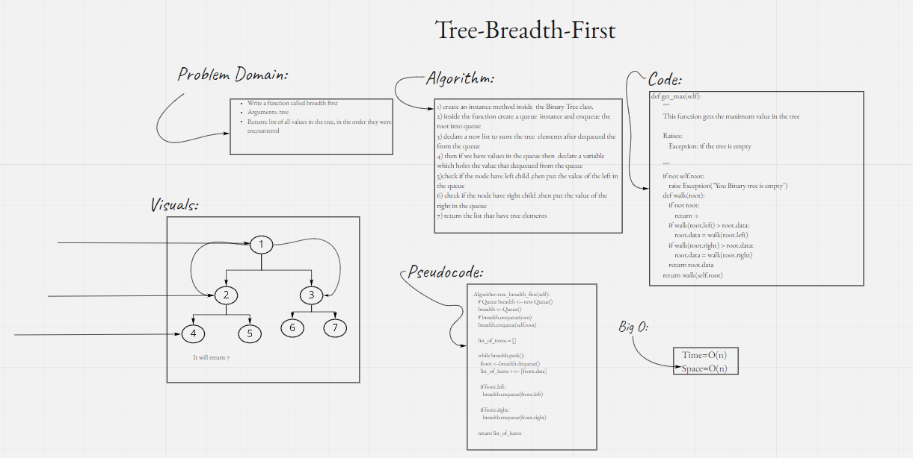

# Trees
- a binary tree is a tree data structure in which each node has at most two children, which are referred to as the left child and the right child

- Check [Binary Trees](https://github.com/majedalswaeer/data-structures-and-algorithms/tree/trees/python/trees) out

## Challenge
Creating node,queue and binary search classes to implement methods such as add and contain

## Approach & Efficiency
- `preorder` , `in order`, `postorder` and `getmax` has big O of `O(1)`, also contain and add has big O of `O(n)` for time and `O(1)` for space

## API
- `tree-breadth-first`
    
    ```
    A binary tree method which returns a list of items that it contains

    input: None

    output: tree items
     ```

- `pre_order`

    ```
    A binary tree method which returns a list of items that it contains

    input: None

    output: tree items

    sub method : walk () to make the recursion staff

    ```
- `in_order`
    ```
    function to in order the list using Trees

    ```
- `post_order`

    ```
    A binary tree method which returns a list of items in post order

    input: None

    output: tree items

    ```
- `add`
    ```
    This function adds a node to the binary tree

        Args:
            value : Str or int
    ```
- `contains`
    ```
    This function checks if a value existed in the binary tree or not

        Args:
            value : Str or int
        return: True or False
    ```
- `get max`
    ```
    This function gets the maximum value in the tree

    Raises:
        Exception: if the tree is empty
    ```
